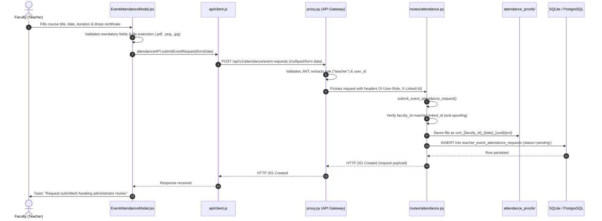
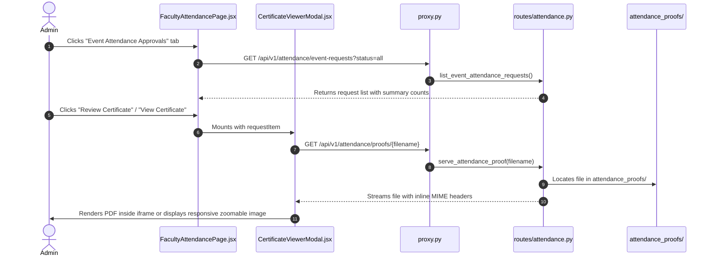
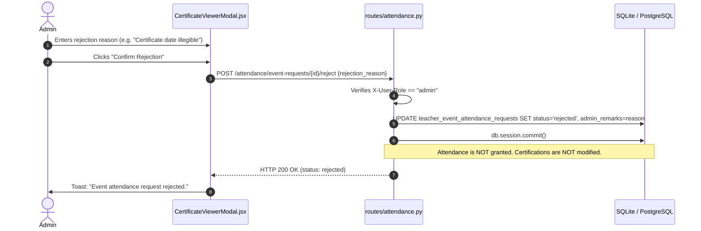

# Execution Flow & Traceability Map (FLOW.md)

This document traces the exact path of execution across files, functions, and modules in AcademiQ — detailing what calls what, in what order, data payloads, and where state transitions occur.

---

## 1. System Topology Overview

```
[ Browser / React App ] (Port 3000)
       │
       ▼ (HTTP / Multipart / Bearer JWT)
[ API Gateway ] (Port 8000)
  └─ backend/api-gateway/middleware/proxy.py
       │
       ▼ (Reverse Proxy with X-User-* Headers)
[ Academic Data Service ] (Port 8002)
  ├─ backend/academic-data-service/routes/attendance.py
  ├─ backend/academic-data-service/timetable_models.py
  ├─ backend/academic-data-service/models.py
  └─ Filesystem: attendance_proofs/
       │
       ▼ (SQLAlchemy ORM)
[ PostgreSQL / SQLite Database ]
  ├─ teacher_event_attendance_requests
  ├─ faculty_daily_attendance
  ├─ attendance_events
  └─ faculty
```

---

## 2. Flow 1: Teacher Requests Event Attendance with Certificate Upload

This flow is initiated when a teacher submits proof for an external course, FDP, workshop, or conference.



### Traceability Path
1. **Frontend Trigger**:
   - `frontend/app/src/components/EventAttendanceModal.jsx` → `handleSubmit(e)`
   - Constructs `FormData`: `faculty_id`, `course_name`, `event_type`, `organizer`, `event_date`, `is_full_day`, `start_time`, `end_time`, `certificate`.
2. **API Client**:
   - `frontend/app/src/api/client.js` → `attendanceAPI.submitEventRequest(formData)`
   - POSTs to `${API_URL}/attendance/event-requests` with `Authorization: Bearer <token>`.
3. **Gateway Middleware**:
   - `backend/api-gateway/middleware/proxy.py` → `proxy(subpath)`
   - Matches route prefix `("/attendance", "ACADEMIC_DATA_SERVICE_URL", True, _STAFF)`.
   - Injects `X-User-Role`, `X-User-Id`, `X-Linked-Id`, and passes raw multipart stream via `requests.request()`.
4. **Backend Route Handler**:
   - `backend/academic-data-service/routes/attendance.py` → `submit_event_attendance_request()`
   - Validates user role: if not admin, ensures `faculty_id == linked_id`.
   - Validates file extension against `ALLOWED_PROOF_EXTENSIONS` (`.pdf`, `.png`, `.jpg`, `.jpeg`, `.webp`).
   - Persists certificate in `backend/academic-data-service/attendance_proofs/`.
   - Creates instance of `TeacherEventAttendanceRequest` (`timetable_models.py`).
   - Executes `db.session.add()` and `db.session.commit()`.

---

## 3. Flow 2: Admin Inspects Request & Previews Certificate Proof



### Traceability Path
1. **Frontend View**:
   - `frontend/app/src/pages/FacultyAttendancePage.jsx` → `loadEventRequests()`
   - Calls `attendanceAPI.listEventRequests()`.
2. **Modal Mount**:
   - User clicks `View Certificate` → sets `selectedReqForViewer = req` and `viewerModalOpen = true`.
   - `frontend/app/src/components/CertificateViewerModal.jsx` mounts.
3. **Proof Fetch**:
   - `proofUrl` generated via `attendanceAPI.getProofUrl(certificate_filename)`.
   - If `.pdf`: `<iframe src={proofUrl} title="Certificate PDF Preview" />`.
   - If image: ``.
4. **File Serving Endpoint**:
   - `backend/academic-data-service/routes/attendance.py` → `serve_attendance_proof(filename)`
   - Uses `send_from_directory(proofs_dir, safe_filename)`.

---

## 4. Flow 3: Admin Approves Event Attendance (Automated Two-Pronged Execution)

This is the core automation: granting daily attendance as `PRESENT` and appending the credential to the faculty profile certifications.

```mermaid
sequenceDiagram
    autonumber
    actor Admin
    participant Viewer as CertificateViewerModal.jsx
    participant Client as api/client.js
    participant Gateway as proxy.py
    participant Controller as routes/attendance.py
    participant DB as SQLite / PostgreSQL
    participant Page as FacultyAttendancePage.jsx

    Admin->>Viewer: Types optional admin remarks & clicks "Approve & Grant Attendance"
    Viewer->>Client: attendanceAPI.approveEventRequest(req_id, {admin_remarks})
    Client->>Gateway: POST /api/v1/attendance/event-requests/{id}/approve
    Gateway->>Gateway: Verifies X-User-Role == "admin"
    Gateway->>Controller: approve_event_attendance_request(req_id)
    
    rect rgb(20, 35, 45)
    Note over Controller,DB: Automation 1: Update Request Status
    Controller->>DB: UPDATE teacher_event_attendance_requests SET status='approved', reviewed_by=admin_id, reviewed_at=now()
    end

    rect rgb(15, 45, 30)
    Note over Controller,DB: Automation 2: Grant Daily Attendance
    Controller->>DB: Upsert faculty_daily_attendance (faculty_id, event_date)
    Controller->>DB: SET status='PRESENT', scheduled_start='09:00', scheduled_end='17:00', duration=480 min
    Controller->>DB: INSERT INTO attendance_events (IN at 09:00, OUT at 17:00, source='EVENT_ATTENDANCE')
    end

    rect rgb(45, 25, 45)
    Note over Controller,DB: Automation 3: Add to Faculty Profile Certifications
    Controller->>DB: SELECT certifications FROM faculty WHERE faculty_id=req.faculty_id
    Controller->>Controller: Parse JSON array, append "{course_name} — {organizer} ({year})"
    Controller->>DB: UPDATE faculty SET certifications = json.dumps(updated_certs)
    Controller->>DB: db.session.commit()
    end

    Controller-->>Gateway: HTTP 200 OK (updated request, daily record, certifications)
    Gateway-->>Client: HTTP 200 OK
    Client-->>Viewer: Success callback
    Viewer->>Page: Triggers onApproved()
    Page->>Page: Reloads loadEventRequests(), loadCampusData(), and loadFacultyHistory()
    Page->>Admin: Toast: "Event request approved! Attendance granted & certification added."
```



### Traceability Path
1. **Controller Execution**:
   - `backend/academic-data-service/routes/attendance.py` → `approve_event_attendance_request(req_id)`
   - Role check: verifies `X-User-Role == "admin"`.
2. **Attendance Granting Logic**:
   - Locates or creates `FacultyDailyAttendance` record for `(faculty_id, event_date)`.
   - Explicitly sets `daily.status = "PRESENT"`.
   - Sets `daily.work_duration_minutes = 480`.
   - Creates two `AttendanceEvent` records (`IN` and `OUT`) with `source="EVENT_ATTENDANCE"`.
3. **Certification Synchronization Logic**:
   - Fetches `Faculty` record via `Faculty.query.filter_by(faculty_id=req_item.faculty_id).first()`.
   - Deserializes `faculty.certifications` JSON list.
   - Formats string: `f"{course_name} — {organizer} ({year})"`.
   - Appends if non-duplicate: `current_certs.append(cert_title)`.
   - Serializes back: `faculty.certifications = json.dumps(current_certs)`.
   - Executes `db.session.commit()`.
4. **Downstream UI Updates**:
   - `FacultyAttendancePage.jsx` re-fetches requests and roster.
   - `FacultyPage.jsx` automatically displays the newly approved certification in the "Industry Certifications" card with a `Verified` tag.

---

## 5. Flow 4: Protection in Daily Attendance Recomputation

```mermaid
flowchart TD
    A[recompute_daily_attendance(faculty_id, target_date)] --> B[Fetch AttendanceEvent records for date]
    B --> C{Approved LeaveNotice exists?}
    C -- Yes (Full Day) --> D[Set status = ON_LEAVE]
    C -- No --> E{Approved TeacherEventAttendanceRequest exists?}
    E -- Yes --> F[Set status = PRESENT<br/>duration = 480 mins<br/>Return daily record]
    E -- No --> G{Any punch events?}
    G -- No --> H[Set status = ABSENT or NOT_YET_MARKED]
    G -- Yes --> I[Evaluate IN / OUT timestamps: PRESENT, LATE, or HALF_DAY]
```

### Traceability Path
- File: `backend/academic-data-service/routes/attendance.py`
- Function: `recompute_daily_attendance(faculty_id, target_date)`
- Lines 96–111 intercept dates where `TeacherEventAttendanceRequest.status == 'approved'`.
- Prevents daily campus roster reconciliations or midnight background cron jobs from reverting the teacher's status to `ABSENT` due to a lack of physical biometric kiosk swipes.

---

## 6. Flow 5: Admin Rejection Flow



---

## 7. Traceability Matrix

| User Action | Frontend Component | API Client Method | HTTP Route | Backend Controller | DB Model / Entity | DB Table |
|---|---|---|---|---|---|---|
| Request Event Attendance | `EventAttendanceModal.jsx` | `attendanceAPI.submitEventRequest` | `POST /attendance/event-requests` | `submit_event_attendance_request()` | `TeacherEventAttendanceRequest` | `teacher_event_attendance_requests` |
| View Requests List | `FacultyAttendancePage.jsx` | `attendanceAPI.listEventRequests` | `GET /attendance/event-requests` | `list_event_attendance_requests()` | `TeacherEventAttendanceRequest` | `teacher_event_attendance_requests` |
| View Certificate Proof | `CertificateViewerModal.jsx` | `attendanceAPI.getProofUrl` | `GET /attendance/proofs/<filename>` | `serve_attendance_proof()` | Filesystem | `attendance_proofs/` |
| Approve Request | `CertificateViewerModal.jsx` | `attendanceAPI.approveEventRequest` | `POST /attendance/event-requests/<id>/approve` | `approve_event_attendance_request()` | `TeacherEventAttendanceRequest`<br/>`FacultyDailyAttendance`<br/>`AttendanceEvent`<br/>`Faculty` | `teacher_event_attendance_requests`<br/>`faculty_daily_attendance`<br/>`attendance_events`<br/>`faculty` |
| Reject Request | `CertificateViewerModal.jsx` | `attendanceAPI.rejectEventRequest` | `POST /attendance/event-requests/<id>/reject` | `reject_event_attendance_request()` | `TeacherEventAttendanceRequest` | `teacher_event_attendance_requests` |
| Withdraw Request | `FacultyAttendancePage.jsx` | `attendanceAPI.cancelEventRequest` | `DELETE /attendance/event-requests/<id>` | `cancel_event_attendance_request()` | `TeacherEventAttendanceRequest` | `teacher_event_attendance_requests` |
| Display Credentials | `FacultyPage.jsx` | `facultyAPI.list` / `facultyAPI.get` | `GET /faculty/` | `list_faculty()` | `Faculty` | `faculty` |
